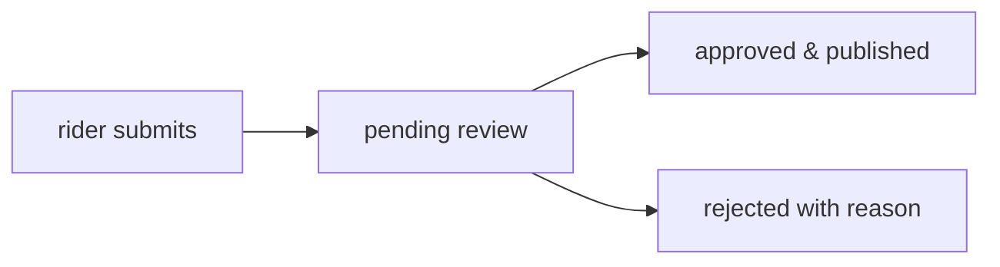

## philosophy

une.haus is community-driven. any rider can contribute. all contributions go through admin review so quality stays high while the doors stay open.

## what you can contribute

- submit new tricks to the [trick library](/docs/tricks)
- propose updates to existing tricks
- add videos to trick entries
- suggest new glossary [elements and modifiers](/docs/tricks/glossary)
- suggest edits to [vault](/docs/vault/suggesting-edits) content (rider attribution, metadata)
- flag inappropriate content

## the review process

all contributions go through admin review before they go live. when you suggest an edit, your changes are shown as a diff so reviewers can see exactly what's being updated and why.

## feedback

you can submit general feedback, bug reports, or feature requests directly from the feedback page. image and video attachments are supported.

## more details

- [contributing tricks](/docs/tricks/contributing) -- submitting tricks, proposing updates, adding videos
- [suggesting vault edits](/docs/vault/suggesting-edits) -- fixing metadata and rider attribution
