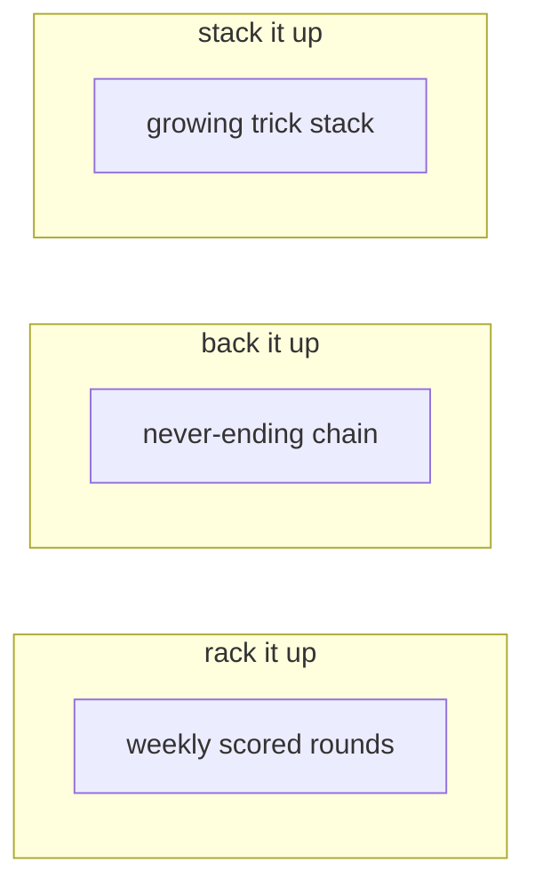

## overview

une.haus has three game modes instead of one. each challenges different skills and has its own rhythm.

## rack it up

the original weekly competitive game. riders upload creative sets and submit for each other's tricks. the rider with the most points wins the round.

[read more about rack it up](/docs/games/rack-it-up)

## back it up

a never-ending chain. one rider sets a trick, the next backs it up and sets a new one. it just keeps going.

[read more about back it up](/docs/games/back-it-up)

## stack it up

land every trick in a growing stack, then add your own. consistency wins as the line gets longer with each rider.

[read more about stack it up](/docs/games/stack-it-up)

## at a glance

|               | rack it up                  | back it up             | stack it up            |
| ------------- | --------------------------- | ---------------------- | ---------------------- |
| format        | weekly rounds               | never-ending chain     | growing stack          |
| sets          | up to 3 per round           | 1 (backup + new trick) | full stack + new trick |
| scoring       | points (sets + submissions) | n/a                    | consistency            |
| end condition | round ends weekly           | never                  | archive votes          |

## engagement

all games support comments and likes on sets and submissions. you can also subscribe to [game reminders](/docs/community/notifications) so you never miss a round.
