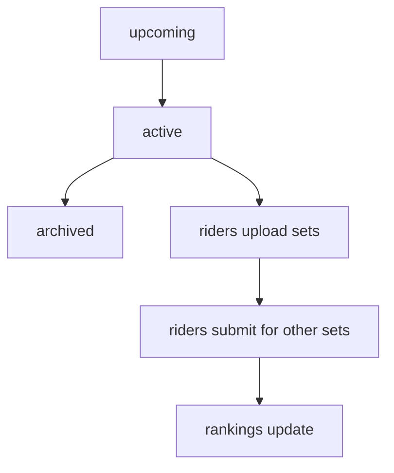
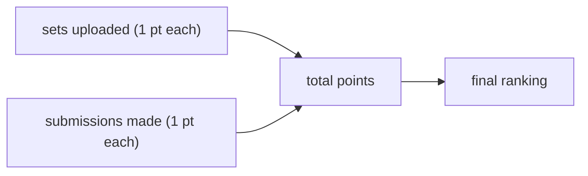

## how it works

rack it up (RIU) runs in weekly rounds. you upload up to 3 creative sets with video, and submit (reply video) for other riders' sets. the rider with the most points at the end of the round wins.

## round states

- **upcoming** -- the next round. upload your sets in advance.
- **active** -- the current round. submit for other riders' sets.
- **archived** -- browse past rounds and their results.

## uploading a set

navigate to the upcoming round and upload your video. you can upload up to 3 sets per round. a set is a video of tricks you want other riders to try.

## submitting for sets

during the active round, click on any set to watch it, then submit your attempt with a reply video. you earn a point for each submission.

## scoring

each set you upload earns 1 point. each submission you make for another rider's set earns 1 point. in a tie, riders who uploaded sets rank higher than those who only submitted. further tiebreakers go by last set upload time, then last submission time.

## comments and likes

engage with sets and submissions through comments and likes. subscribe to [game start reminders](/docs/community/notifications) to get notified before each round.
