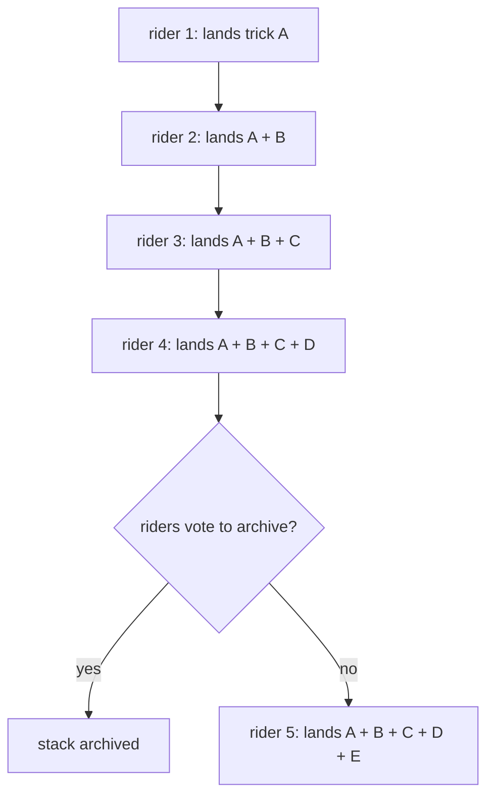

## how it works

a rider sets a trick. the next rider must land every trick before it plus a new one, all in a single line. stack it up (SIU) grows with each rider.

## consistency wins

as more riders add tricks, the line gets longer. every trick from the history must be performed in order. it's a test of consistency and memory.

## how it's different from back it up

in **back it up**, you only need to land the _last_ trick before adding a new one. in **stack it up**, you land the _entire stack_ -- every trick from the beginning -- before adding yours.

## when does it end

when riders find the stack too difficult, they vote to archive the round. after enough archive votes, the round ends.

## archive votes

any signed-in rider can cast one archive vote per round. when the community is ready to move on, the round gets archived and a new stack can begin.

## active vs archived

browse current active games or past archived rounds to see how far the stack got. multiple stacks can be active at the same time.

## rules

you cannot stack your own trick. you have to wait for another rider to go first.
