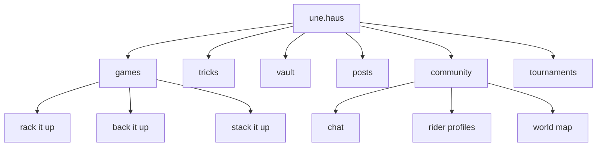

## what is une.haus

une.haus is a community platform for unicyclists. it brings together competitive games, a full trick database, the unicycle.tv video archive, and social features -- all in one place. rebuilt from the ground up after skrrrt.io.

## explore the docs

- [getting started](/docs/getting-started) -- create your account and find your way around
- [games](/docs/games) -- three competitive game modes, each with its own rhythm
- [tricks](/docs/tricks) -- the full searchable trick library
- [vault](/docs/vault) -- the unicycle.tv video archive
- [posts](/docs/posts) -- community discussions
- [chat](/docs/chat) -- real-time global chat
- [tournaments](/docs/tournaments) -- bracket-style competitions
- [community](/docs/community) -- profiles, following, notifications
- [contributing](/docs/contributing) -- help shape the platform
- [reference](/docs/reference) -- shortcuts, disciplines, tags, and quick facts

for the full welcome letter, visit [the intro page](/intro).
