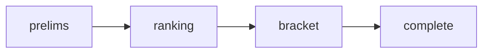
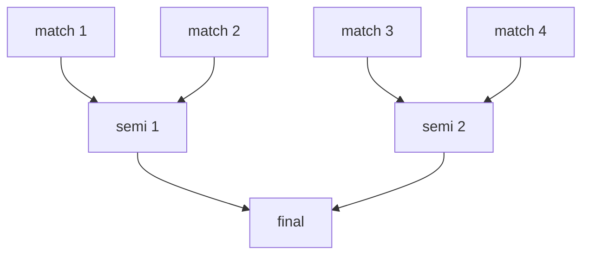

## phases

tournaments move through four phases:

- **prelims** -- every rider gets a timed run to show their best stuff. the organizer controls a countdown timer and marks each rider as done or disqualified.
- **ranking** -- riders are ordered based on prelim results. the top performers advance to the bracket based on bracket size (top 4, 8, 16, or 32).
- **bracket** -- single-elimination head-to-head battles. the organizer starts a split timer for each match and picks the winner. this continues through quarters, semis, and the final.
- **complete** -- the tournament is over and the champion is crowned with a celebration.

## setup

the organizer creates a tournament and configures:

- **bracket size** -- 4, 8, 16, or 32 riders
- **prelims timer** -- how long each rider gets (30 seconds to 3 minutes)
- **battle timer** -- how long each head-to-head match lasts
- **finals timer** -- optionally longer for the final matchup

then they add riders to the roster -- existing une.haus users or names entered manually.

## admin controls

the tournament creator manages everything from their device:

- start/pause timers for each rider or match
- mark riders as done or disqualified during prelims
- pick winners during bracket matches
- advance the tournament through each phase

## bracket

the bracket visualization shows all matches and results as the tournament progresses. when the final match is decided, confetti rains and the champion is displayed.

## live view

every tournament has a public page with real-time updates. spectators don't need an account -- they enter the tournament code and watch the bracket, timers, and results update live. designed to work on a big screen at events.
