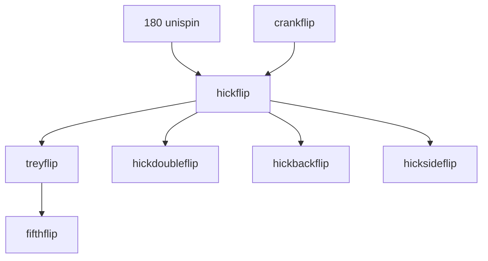

## browsing

the trick library is a sortable table showing name, description, and element badges. virtual scrolling handles the full list smoothly.

## searching and filtering

filter tricks by name or by elements. filters are debounced and reflected in the URL, so you can share a filtered view with someone else.

## trick detail pages

each trick has its own page with full details, linked videos, and prerequisites.

## how tricks connect

tricks form a web of relationships. each trick connects to others that differ by just one change -- a bit more spin, an added flip, a modifier.

there's also a prerequisite chain -- a learning path that tells you what to work on before attempting harder tricks.

## alternate names

tricks can have multiple names and all of them are searchable.

## more

- [glossary](/docs/tricks/glossary) -- elements and modifiers explained
- [contributing tricks](/docs/tricks/contributing) -- submit new tricks, propose updates, add videos
