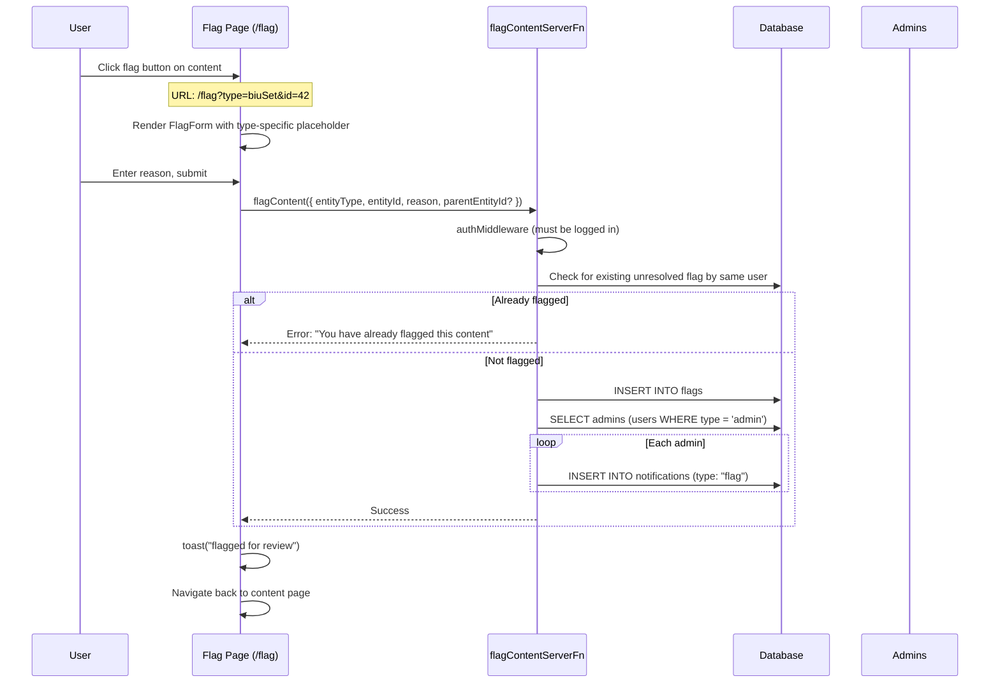
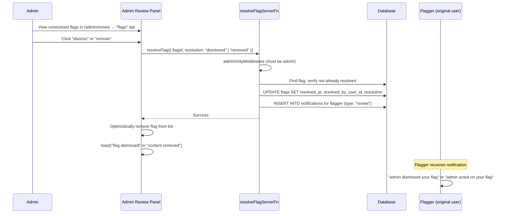

# Flagging System

A unified content moderation system that lets any authenticated user flag any piece of content for admin review. All flags are stored in a single `flags` table regardless of entity type.

## Table of Contents

- [Overview](#overview)
- [Architecture](#architecture)
- [Database Schema](#database-schema)
- [Entity Types](#entity-types)
- [Flag Flow](#flag-flow)
- [Resolve Flow](#resolve-flow)
- [API Reference](#api-reference)
- [UI Integration](#ui-integration)
- [Admin Review](#admin-review)
- [Notification Wiring](#notification-wiring)

---

## Overview

```
┌─────────────────────────────────────────────────────────────────┐
│                     FLAGGABLE CONTENT                            │
├──────────────────┬──────────────────┬───────────────────────────┤
│   GAME ENTITIES  │    POSTS         │    MESSAGES               │
│                  │                  │                           │
│  • BIU sets      │  • Posts         │  • Post messages          │
│  • SIU sets      │                  │  • BIU set messages       │
│  • RIU sets      │                  │  • SIU set messages       │
│  • RIU submits   │                  │  • RIU set messages       │
│                  │                  │  • RIU submission msgs    │
│                  │                  │  • Vault video messages   │
│                  │                  │  • Chat messages          │
└──────────────────┴──────────────────┴───────────────────────────┘
                              │
                              ▼
┌─────────────────────────────────────────────────────────────────┐
│                     FLAGS TABLE                                  │
│  ┌───────────────┐  ┌───────────────┐  ┌───────────────────┐   │
│  │   Single      │  │   Duplicate   │  │   Notification    │   │
│  │   Table       │──│   Prevention  │──│   to Admins       │   │
│  └───────────────┘  └───────────────┘  └───────────────────┘   │
└─────────────────────────────────────────────────────────────────┘
                              │
                              ▼
┌─────────────────────────────────────────────────────────────────┐
│                     ADMIN REVIEW                                 │
│  ┌───────────────┐  ┌───────────────┐  ┌───────────────────┐   │
│  │  /admin/review │  │  Dismiss or   │  │  Notify Flagger   │   │
│  │  "flags" tab   │──│  Remove       │──│  of Resolution    │   │
│  └───────────────┘  └───────────────┘  └───────────────────┘   │
└─────────────────────────────────────────────────────────────────┘
```

---

## Architecture

### System Components

```
src/
├── db/schema.ts                          # flags table + flag_entity_type enum
│
├── lib/flags/                            # Core flag logic
│   ├── schemas.ts                        # Zod schemas (flagContent, resolveFlag)
│   ├── fns.ts                            # Server functions (flag, resolve, list)
│   ├── hooks.ts                          # useFlagContent() mutation hook
│   └── index.ts                          # flagsDomain facade
│
├── components/forms/flag-form.tsx        # Reusable flag form (reason + submit)
│
├── routes/_authed/flag.tsx               # Flag submission page (all entity types)
│
└── routes/_authed/admin/review.tsx       # Admin panel with "flags" tab
```

### Design Decisions

| Decision                      | Rationale                                                                                      |
| ----------------------------- | ---------------------------------------------------------------------------------------------- |
| Single `flags` table          | Eliminates scattered flag columns across 4+ tables; one place to query, one schema to maintain |
| No chain-pausing on flag      | Flags are informational — gameplay continues uninterrupted while admin reviews                 |
| `parentEntityId` for messages | Messages need their parent entity ID for back-navigation after flagging                        |
| Duplicate prevention per user | A user can't flag the same entity twice (checked server-side)                                  |
| Resolution is informational   | `"dismissed"` or `"removed"` — the system doesn't auto-delete content                          |

---

## Database Schema

### flags table

```sql
CREATE TABLE flags (
  id                  SERIAL PRIMARY KEY,
  entity_type         flag_entity_type NOT NULL,
  entity_id           INTEGER NOT NULL,
  reason              TEXT NOT NULL,
  user_id             INTEGER NOT NULL REFERENCES users(id) ON DELETE CASCADE,
  created_at          TIMESTAMP NOT NULL DEFAULT NOW(),
  resolved_at         TIMESTAMP,
  resolved_by_user_id INTEGER REFERENCES users(id) ON DELETE SET NULL,
  resolution          TEXT,              -- "dismissed" | "removed"
  parent_entity_id    INTEGER            -- only for message flags
);
```

### flag_entity_type enum

```sql
CREATE TYPE flag_entity_type AS ENUM (
  'post',
  'biuSet',
  'siuSet',
  'riuSet',
  'riuSubmission',
  'postMessage',
  'biuSetMessage',
  'siuSetMessage',
  'riuSetMessage',
  'riuSubmissionMessage',
  'utvVideoMessage',
  'chatMessage'
);
```

### Entity Relationship Diagram

```
┌──────────────────────────────────────────────────────────────────┐
│                           users                                   │
│  id | name | email | avatarId | type | ...                       │
└──────────────────────────────────────────────────────────────────┘
        │                        │
        │ 1:many (flagger)       │ 1:many (resolver)
        ▼                        ▼
┌──────────────────────────────────────────────────────────────────┐
│                           flags                                   │
│                                                                   │
│  id                    SERIAL PK                                  │
│  entity_type           flag_entity_type (enum)                    │
│  entity_id             INTEGER                                    │
│  reason                TEXT                                        │
│  user_id               INTEGER FK → users.id (flagger)            │
│  created_at            TIMESTAMP                                   │
│  resolved_at           TIMESTAMP (null = unresolved)              │
│  resolved_by_user_id   INTEGER FK → users.id (admin who resolved) │
│  resolution            TEXT ("dismissed" | "removed")             │
│  parent_entity_id      INTEGER (for message flags only)           │
└──────────────────────────────────────────────────────────────────┘
```

### Relations

```typescript
export const flagsRelations = relations(flags, ({ one }) => ({
  user: one(users, {
    fields: [flags.userId],
    references: [users.id],
    relationName: "flagUser",
  }),
  resolvedByUser: one(users, {
    fields: [flags.resolvedByUserId],
    references: [users.id],
    relationName: "flagResolvedByUser",
  }),
}))
```

---

## Entity Types

### Content Entities (5)

| Entity Type     | Source Table      | Flag Button Location                                        |
| --------------- | ----------------- | ----------------------------------------------------------- |
| `post`          | `posts`           | `src/views/post.tsx`                                        |
| `biuSet`        | `biu_sets`        | `src/routes/games/bius/sets/$setId/index.tsx`               |
| `siuSet`        | `siu_sets`        | `src/routes/games/sius/sets/$setId/index.tsx`               |
| `riuSet`        | `riu_sets`        | `src/routes/games/rius/sets/$setId/index.tsx`               |
| `riuSubmission` | `riu_submissions` | `src/routes/games/rius/submissions/$submissionId/index.tsx` |

### Message Entities (7)

| Entity Type            | Parent Entity   | Flag Button Location                         |
| ---------------------- | --------------- | -------------------------------------------- |
| `postMessage`          | `post`          | `src/components/messages/message-bubble.tsx` |
| `biuSetMessage`        | `biuSet`        | same                                         |
| `siuSetMessage`        | `siuSet`        | same                                         |
| `riuSetMessage`        | `riuSet`        | same                                         |
| `riuSubmissionMessage` | `riuSubmission` | same                                         |
| `utvVideoMessage`      | `utvVideo`      | same                                         |
| `chatMessage`          | `chat`          | same                                         |

Message flags store `parentEntityId` so the admin can navigate to the page where the message lives.

### Entity Type Mapping for Notifications

When a flag is created or resolved, the notification system needs an entity type + ID for URL routing. Message flag types map to their parent entity type:

```typescript
const FLAG_TO_NOTIFICATION_ENTITY: Record<
  FlagEntityType,
  NotificationEntityType
> = {
  post: "post",
  biuSet: "biuSet",
  siuSet: "siuSet",
  riuSet: "riuSet",
  riuSubmission: "riuSubmission",
  // Message flags → parent entity type
  postMessage: "post",
  biuSetMessage: "biuSet",
  siuSetMessage: "siuSet",
  riuSetMessage: "riuSet",
  riuSubmissionMessage: "riuSubmission",
  utvVideoMessage: "utvVideo",
  chatMessage: "chat",
}
```

---

## Flag Flow



---

## Resolve Flow



---

## API Reference

### Server Functions

#### flagContentServerFn

Creates a new flag. Requires authentication.

```typescript
flagContentServerFn({
  data: {
    entityType: FlagEntityType,  // e.g. "biuSet", "postMessage"
    entityId: number,            // ID of the flagged entity
    reason: string,              // User-provided reason (min 1 char)
    parentEntityId?: number,     // Required for message types
  }
})
```

**Behavior:**

- Prevents duplicate flags (same user + same entity + unresolved)
- Notifies all admins via the notification system

#### resolveFlagServerFn

Resolves a flag. Requires admin role.

```typescript
resolveFlagServerFn({
  data: {
    flagId: number,
    resolution: "dismissed" | "removed",
  },
})
```

**Behavior:**

- Sets `resolvedAt`, `resolvedByUserId`, `resolution` on the flag
- Notifies the original flagger with the resolution outcome

#### listFlagsServerFn

Lists all unresolved flags. Requires admin role.

```typescript
listFlagsServerFn()
// Returns: Array<{
//   id, entityType, entityId, reason, createdAt, parentEntityId,
//   user: { id, name, avatarId }
// }>
```

**Behavior:**

- Returns flags where `resolvedAt IS NULL`
- Ordered by `createdAt DESC` (newest first)
- Includes flagger user info

### Facade

```typescript
import { flagsDomain } from "~/lib/flags"

// Create a flag
flagsDomain.flag.fn({ data: { ... } })
flagsDomain.flag.schema  // Zod schema for validation

// Resolve a flag
flagsDomain.resolve.fn({ data: { flagId, resolution } })
flagsDomain.resolve.schema

// List unresolved flags (admin)
flagsDomain.list.fn()
flagsDomain.list.queryOptions()  // queryKey: ["flags.list"]
```

### Hooks

```typescript
import { useFlagContent } from "~/lib/flags/hooks"

const flagContent = useFlagContent()
flagContent.mutate({ data: { entityType, entityId, reason } })
// onSuccess: toast("flagged for review")
// onError: toast(error.message)
```

---

## UI Integration

### FlagTray Component

**File:** `src/components/flag-tray.tsx`

A reusable `<FlagTray>` component renders an inline flag button that opens a Tray (dialog on desktop, drawer on mobile) with a reason form. No route navigation is needed.

```tsx
<FlagTray entityType="post" entityId={post.id} />
<FlagTray entityType="biuSet" entityId={set.id} />
<FlagTray entityType="riuSubmission" entityId={submission.id} parentEntityId={parentId} />
```

Props:

| Prop             | Type             | Required | Description                           |
| ---------------- | ---------------- | -------- | ------------------------------------- |
| `entityType`     | `FlagEntityType` | Yes      | One of the 12 entity types            |
| `entityId`       | `number`         | Yes      | ID of the entity being flagged        |
| `parentEntityId` | `number`         | No       | Parent entity ID (message types only) |
| `placeholder`    | `string`         | No       | Custom placeholder text               |

### Content Entity Flag Buttons

Game detail pages and the post view render `<FlagTray>` inline (visible to logged-in non-owners):

```tsx
// Post detail (src/views/post.tsx)
{
  sessionUser && !isOwner && <FlagTray entityType="post" entityId={post.id} />
}
```

Game entity pages use the same pattern with their respective entity types (`biuSet`, `siuSet`, `riuSet`, `riuSubmission`).

### Message Flag Menu Item

**File:** `src/components/messages/message-bubble.tsx`

Messages show a "flag" option in the long-press context menu. Clicking it opens a `MessageFlagTray` (internal component) instead of navigating. The message type is derived from the parent type.

**Note:** The message type is derived from the parent type (e.g., `post` → `postMessage`, `chat` → `chatMessage`).

---

## Admin Review

**File:** `src/routes/_authed/admin/review.tsx`

The admin review page has three outer tabs: **tricks**, **vault**, and **flags**. The flags tab shows all unresolved flags in a single list.

### Tab with Count Badge

```
┌─────────────────────────────────────────────────────────────┐
│  [ tricks (12) ]  [ vault (3) ]  [ flags (2) ]             │
└─────────────────────────────────────────────────────────────┘
```

The count badge shows the number of unresolved flags.

### Flag Card

Each flag card displays:

```
┌─────────────────────────────────────────────────────────────┐
│  [BIU set]                            alice · 2 hours ago   │
│                                                             │
│  "the rider didn't fully land the previous set"             │
│                                                             │
│                              [ remove ]  [ dismiss ]        │
└─────────────────────────────────────────────────────────────┘
```

- **Entity type badge** — human-readable label (e.g. "BIU set", "post message")
- **Flagger** — name + relative timestamp, links to user profile
- **Reason** — rendered as rich text
- **Actions** — "remove" (destructive) and "dismiss" (outline)

### Optimistic Updates

Resolving a flag optimistically removes it from the list:

```typescript
const resolveFlag = useMutation({
  mutationFn: flagsDomain.resolve.fn,
  onMutate: async ({ data: { flagId } }) => {
    await qc.cancelQueries({ queryKey: flagsKey })
    const prev = qc.getQueryData(flagsKey)
    qc.setQueryData(flagsKey, (old) =>
      old?.filter((item) => item.id !== flagId),
    )
    return { prev }
  },
  onError: (error, _, context) => {
    if (context?.prev) qc.setQueryData(flagsKey, context.prev)
  },
  onSettled: () => {
    qc.invalidateQueries({ queryKey: flagsKey })
  },
})
```

---

## Notification Wiring

### On Flag Creation

Notifies **all admins** with `type: "flag"`:

```
┌──────────────┐     ┌──────────────┐     ┌──────────────┐
│  User flags   │────►│  INSERT flag  │────►│ Notify each  │
│  content      │     │  row         │     │ admin        │
└──────────────┘     └──────────────┘     └──────────────┘
                                                 │
                                           type: "flag"
                                           entityType: mapped
                                           entityId: mapped
```

For message flags, the notification entity type and ID are mapped to the **parent** entity so the notification URL navigates to the page where the message lives.

### On Flag Resolution

Notifies **the original flagger** with `type: "review"`:

| Resolution    | entityTitle             |
| ------------- | ----------------------- |
| `"dismissed"` | `"dismissed your flag"` |
| `"removed"`   | `"acted on your flag"`  |

---

## Summary

```
┌────────────────────────────────────────────────────────────────┐
│                    FLAGGING SYSTEM                               │
│                                                                 │
│  TRIGGER             STORAGE              RESOLUTION            │
│  ──────              ───────              ──────────            │
│  • Flag button  ───► • Single flags  ───► • Admin review tab    │
│  • Flag menu item    • table               • Dismiss / Remove   │
│  • /flag route       • Dedup check         • Notify flagger     │
│                      • Notify admins                            │
│                                                                 │
│  ENTITY TYPES                                                   │
│  ────────────                                                   │
│  Content (5): post, biuSet, siuSet, riuSet, riuSubmission     │
│  Messages (7): postMessage, biuSetMessage, siuSetMessage,     │
│                riuSetMessage, riuSubmissionMessage,              │
│                utvVideoMessage, chatMessage                     │
│                                                                 │
│  FILES                                                          │
│  ─────                                                          │
│  db/schema.ts          - flags table + enum                     │
│  lib/flags/            - Domain library (fns, schemas, hooks)   │
│  routes/_authed/flag   - Flag submission page                   │
│  admin/review          - Admin panel ("flags" tab)              │
│  views/post            - Post flag button                       │
│  messages/bubble       - Message flag menu item                 │
│  games/*/detail pages  - Game entity flag buttons               │
│                                                                 │
│  KEY DESIGN DECISIONS                                           │
│  ────────────────────                                           │
│  • Single table for all entity types (no scattered columns)     │
│  • Flags are informational — no chain pausing                   │
│  • Resolution doesn't auto-delete (admin decides externally)    │
│  • Duplicate prevention per user per entity                     │
│  • Message flags store parentEntityId for navigation            │
│  • Chat messages included (chatMessage flag type)               │
│  • Admins notified on flag, flagger notified on resolution      │
└────────────────────────────────────────────────────────────────┘
```
