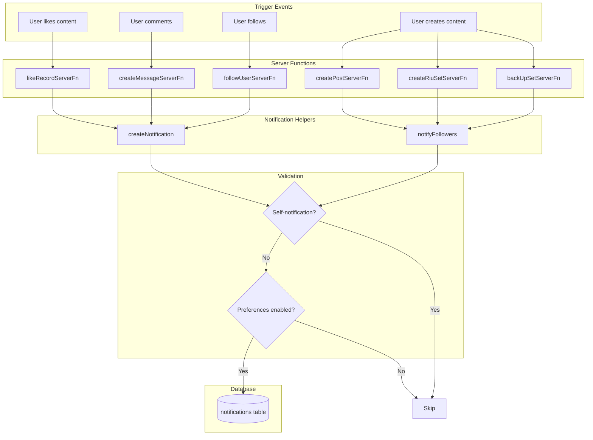
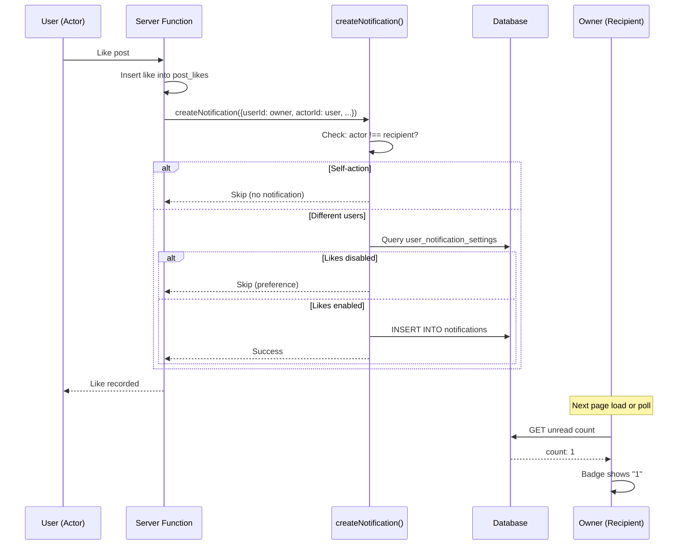
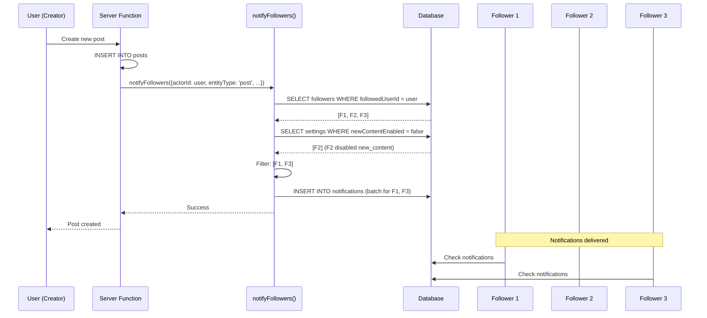
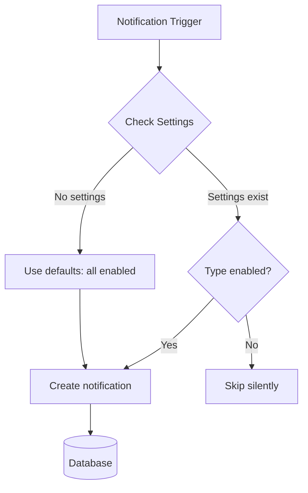

# Notifications System

A comprehensive in-app notification system that alerts users when others interact with their content or when followed users create new content.

## Table of Contents

- [Overview](#overview)
- [Architecture](#architecture)
- [Database Schema](#database-schema)
- [Notification Types](#notification-types)
- [Notification Flow](#notification-flow)
- [Grouping Strategy](#grouping-strategy)
- [User Preferences](#user-preferences)
- [API Reference](#api-reference)
- [UI Components](#ui-components)
- [Email Digests](#email-digests)

---

## Overview

The notification system provides real-time awareness of activity relevant to each user:

```
┌─────────────────────────────────────────────────────────────────┐
│                    NOTIFICATION TRIGGERS                        │
├──────────────────┬──────────────────┬───────────────────────────┤
│   ENGAGEMENT     │    SOCIAL        │      CONTENT              │
│                  │                  │                           │
│  • Like content  │  • Follow user   │  • New post from followed │
│  • Like message  │  • @mention      │  • New RIU set            │
│  • Comment       │                  │  • New BIU set            │
├──────────────────┴──────────────────┴───────────────────────────┤
│   MODERATION / SYSTEM                                          │
│                                                                │
│  • Flag content  • Archive request  • Chain archived  • Review │
└─────────────────────────────────────────────────────────────────┘
                              │
                              ▼
┌─────────────────────────────────────────────────────────────────┐
│                    NOTIFICATION SYSTEM                          │
│  ┌───────────────┐  ┌───────────────┐  ┌───────────────────┐   │
│  │   Database    │  │   Grouping    │  │   Preferences     │   │
│  │   Storage     │──│   Engine      │──│   Filter          │   │
│  └───────────────┘  └───────────────┘  └───────────────────┘   │
└─────────────────────────────────────────────────────────────────┘
                              │
                              ▼
┌─────────────────────────────────────────────────────────────────┐
│                       USER INTERFACE                            │
│  ┌───────────────┐  ┌───────────────┐  ┌───────────────────┐   │
│  │  User Menu    │  │   Dropdown    │  │   Full Page       │   │
│  │  Badge (#)    │  │   Popover     │  │   /notifications  │   │
│  └───────────────┘  └───────────────┘  └───────────────────┘   │
└─────────────────────────────────────────────────────────────────┘
```

---

## Architecture

### System Components

```
src/
├── db/schema.ts                      # Database tables
│   ├── notifications                 # Main notifications table
│   └── userNotificationSettings      # Per-user preferences
│
├── lib/
│   ├── notifications/                # Core notification logic
│   │   ├── schemas.ts               # Zod validation
│   │   ├── fns.ts                   # Server functions (list, mark read, etc.)
│   │   ├── helpers.server.ts        # createNotification(), notifyFollowers()
│   │   ├── hooks.ts                 # React Query mutations
│   │   ├── utils.ts                 # URL routing, message formatting
│   │   └── index.ts                 # Facade object
│   │
│   └── notification-settings/        # User preferences
│       ├── schemas.ts
│       ├── fns.ts
│       └── index.ts
│
├── components/notifications/         # UI components
│   ├── notification-timeline.tsx    # Container and item layout
│   └── notification-item.tsx        # Icon rendering and actor formatting
│
└── routes/_authed/notifications/     # Pages
    ├── index.tsx                    # Full notifications list
    └── settings.tsx                 # Preferences page
```

### Data Flow



---

## Database Schema

### notifications table

```sql
CREATE TABLE notifications (
  id              SERIAL PRIMARY KEY,
  user_id         INTEGER NOT NULL REFERENCES users(id) ON DELETE CASCADE,
  actor_id        INTEGER REFERENCES users(id) ON DELETE CASCADE,
  type            notification_type NOT NULL,
  entity_type     notification_entity_type NOT NULL,
  entity_id       INTEGER NOT NULL,
  data            JSONB,
  created_at      TIMESTAMP NOT NULL DEFAULT NOW(),
  read_at         TIMESTAMP,
  emailed_at      TIMESTAMP
);

-- Indexes for efficient queries
CREATE INDEX idx_notifications_user_id ON notifications(user_id);
CREATE INDEX idx_notifications_user_unread ON notifications(user_id, read_at);
CREATE INDEX idx_notifications_grouping ON notifications(user_id, entity_type, entity_id);
CREATE INDEX idx_notifications_created_at ON notifications(created_at);
```

### user_notification_settings table

```sql
CREATE TABLE user_notification_settings (
  user_id                        INTEGER PRIMARY KEY REFERENCES users(id) ON DELETE CASCADE,
  likes_enabled                  BOOLEAN NOT NULL DEFAULT TRUE,
  comments_enabled               BOOLEAN NOT NULL DEFAULT TRUE,
  follows_enabled                BOOLEAN NOT NULL DEFAULT TRUE,
  new_content_enabled            BOOLEAN NOT NULL DEFAULT TRUE,
  mentions_enabled               BOOLEAN NOT NULL DEFAULT TRUE,
  game_start_reminder_enabled    BOOLEAN NOT NULL DEFAULT TRUE,
  game_start_reminder_hours_before INTEGER NOT NULL DEFAULT 24,
  email_digest_frequency         TEXT NOT NULL DEFAULT 'off',  -- 'off' | 'weekly' | 'monthly'
  email_digest_day_of_week       INTEGER DEFAULT 0,            -- 0=Sunday
  email_digest_day_of_month      INTEGER DEFAULT 1,            -- 1-28
  email_digest_hour_utc          INTEGER DEFAULT 9,
  email_unsubscribed_all         BOOLEAN NOT NULL DEFAULT FALSE,
  updated_at                     TIMESTAMP NOT NULL DEFAULT NOW()
);
```

### Enums

```typescript
// Notification types (what happened)
type NotificationType =
  | "like" // Someone liked your content
  | "message_like" // Someone liked your message/comment
  | "comment" // Someone commented on your content
  | "follow" // Someone followed you
  | "new_content" // Someone you follow created content
  | "mention" // Someone @mentioned you
  | "archive_request" // SIU archive vote on your stack
  | "chain_archived" // A BIU chain you participated in was archived
  | "review" // Admin resolved your flag
  | "flag" // Someone flagged content (sent to admins)

// Entity types (what it happened to)
type NotificationEntityType =
  | "chat"
  | "post"
  | "riuSet"
  | "riuSubmission"
  | "biuSet"
  | "siuSet"
  | "siu"
  | "utvVideo"
  | "utvVideoSuggestion"
  | "user"
  | "trickSubmission"
  | "trickSuggestion"
  | "trickVideo"
  | "glossaryProposal"
```

### Entity Relationship Diagram

```
┌──────────────────────────────────────────────────────────────────┐
│                           users                                   │
│  id | name | email | avatarId | ...                              │
└──────────────────────────────────────────────────────────────────┘
        │                    │
        │ 1:many             │ 1:1
        ▼                    ▼
┌───────────────────┐  ┌─────────────────────────────┐
│   notifications   │  │ user_notification_settings  │
│                   │  │                             │
│ id                │  │ user_id (PK, FK)            │
│ user_id (FK)      │  │ likes_enabled               │
│ actor_id (FK)     │  │ comments_enabled            │
│ type              │  │ follows_enabled             │
│ entity_type       │  │ new_content_enabled         │
│ entity_id         │  │ mentions_enabled            │
│ data (JSONB)      │  │ game_start_reminder_enabled │
│ created_at        │  │ game_start_reminder_hours…  │
│ read_at           │  │ email_digest_frequency      │
│ emailed_at        │  │ email_unsubscribed_all      │
│                   │  │ updated_at                  │
│                   │  └─────────────────────────────┘
└───────────────────┘
```

---

## Notification Types

### User-Facing Types (respect preferences)

#### 1. Like Notifications (`type: "like"`)

Triggered when someone likes your content.

| Entity Type     | Trigger Location           | Example Message               |
| --------------- | -------------------------- | ----------------------------- |
| `post`          | `src/lib/reactions/fns.ts` | "Alice liked your post"       |
| `riuSet`        | `src/lib/reactions/fns.ts` | "Bob liked your RIU set"      |
| `riuSubmission` | `src/lib/reactions/fns.ts` | "Carol liked your submission" |
| `biuSet`        | `src/lib/reactions/fns.ts` | "Dan liked your BIU set"      |
| `utvVideo`      | `src/lib/reactions/fns.ts` | "Eve liked your video"        |

#### 2. Message Like Notifications (`type: "message_like"`)

Triggered when someone likes your comment/message on any entity.

#### 3. Comment Notifications (`type: "comment"`)

Triggered when someone comments on your content.

| Entity Type     | Trigger Location          | Example Message                      |
| --------------- | ------------------------- | ------------------------------------ |
| `post`          | `src/lib/messages/fns.ts` | "Alice commented on your post"       |
| `riuSet`        | `src/lib/messages/fns.ts` | "Bob commented on your RIU set"      |
| `riuSubmission` | `src/lib/messages/fns.ts` | "Carol commented on your submission" |
| `biuSet`        | `src/lib/messages/fns.ts` | "Dan commented on your BIU set"      |
| `utvVideo`      | `src/lib/messages/fns.ts` | "Eve commented on your video"        |

**Note:** Chat messages do NOT trigger comment notifications (no owner to notify).

#### 4. Follow Notifications (`type: "follow"`)

Triggered when someone follows you.

| Entity Type | Trigger Location       | Example Message               |
| ----------- | ---------------------- | ----------------------------- |
| `user`      | `src/lib/users/fns.ts` | "Alice started following you" |

#### 5. New Content Notifications (`type: "new_content"`)

Triggered when someone you follow creates new content.

| Entity Type | Trigger Location            | Example Message                     |
| ----------- | --------------------------- | ----------------------------------- |
| `post`      | `src/lib/posts/fns.ts`      | "Alice posted: 'My new trick'"      |
| `riuSet`    | `src/lib/games/rius/fns.ts` | "Bob created RIU set: 'Hard combo'" |
| `biuSet`    | `src/lib/games/bius/fns.ts` | "Carol backed up: 'Unispin'"        |

#### 6. Mention Notifications (`type: "mention"`)

Triggered when someone @mentions you in a message.

### System Types (bypass preferences)

These notification types are always delivered regardless of user settings.

#### 7. Archive Request (`type: "archive_request"`)

Triggered when someone votes to archive a SIU stack you own.

#### 8. Chain Archived (`type: "chain_archived"`)

Triggered when a BIU chain you participated in is archived.

#### 9. Review (`type: "review"`)

Triggered when an admin resolves a flag you submitted (dismissed or acted upon).

#### 10. Flag (`type: "flag"`)

Triggered when a user flags content. Sent to all admin users.

---

## Notification Flow

### Single Notification (Like/Comment/Follow)



### Follower Notification (New Content)



---

## Grouping Strategy

Notifications are stored individually but **grouped when displayed** for a cleaner UI.

### Storage vs Display

```
DATABASE (Individual Records)                UI (Grouped Display)
┌────────────────────────────────────┐      ┌─────────────────────────────┐
│ id=1: Alice liked post#5           │      │ Alice and 2 others liked    │
│ id=2: Bob liked post#5             │  ──► │ your post: "My trick"       │
│ id=3: Carol liked post#5           │      │ [3 avatars] • 2 min ago     │
└────────────────────────────────────┘      └─────────────────────────────┘

┌────────────────────────────────────┐      ┌─────────────────────────────┐
│ id=4: Dan commented on post#5      │  ──► │ Dan commented on your post  │
└────────────────────────────────────┘      │ [1 avatar] • 5 min ago      │
                                            └─────────────────────────────┘
```

### Grouping Query

```sql
SELECT
  type,
  entity_type,
  entity_id,
  COUNT(*) as count,
  MAX(id) as latest_id,
  MAX(created_at) as latest_at,
  -- Get up to 3 most recent UNIQUE actor IDs (deduplicated)
  (SELECT ARRAY_AGG(top_actors.actor_id)
   FROM (
     SELECT unique_actors.actor_id
     FROM (
       SELECT DISTINCT ON (n2.actor_id) n2.actor_id, n2.created_at
       FROM notifications n2
       WHERE n2.user_id = $userId
         AND n2.type = notifications.type
         AND n2.entity_type = notifications.entity_type
         AND n2.entity_id = notifications.entity_id
       ORDER BY n2.actor_id, n2.created_at DESC
     ) unique_actors
     ORDER BY unique_actors.created_at DESC
     LIMIT 3
   ) top_actors
  ) as actor_ids
FROM notifications
WHERE user_id = $userId
GROUP BY type, entity_type, entity_id
ORDER BY MAX(created_at) DESC
LIMIT 50;
```

**Note:** The triple-nested subquery ensures:

1. Inner: `DISTINCT ON (actor_id)` gets each actor's most recent notification
2. Middle: Orders by recency and limits to 3 most recent unique actors
3. Outer: Aggregates into an array (avoiding GROUP BY conflicts)

### Benefits of This Approach

| Aspect           | Benefit                                         |
| ---------------- | ----------------------------------------------- |
| **Flexibility**  | Can show individual OR grouped views            |
| **Accuracy**     | Each notification has its own read_at timestamp |
| **Simplicity**   | No complex aggregation tables needed            |
| **Deletability** | Can delete individual notifications             |

---

## User Preferences

Users can disable specific notification types via `/notifications/settings`.

### Settings UI

```
┌─────────────────────────────────────────────────────────────┐
│  Notification Settings                              [gear]  │
├─────────────────────────────────────────────────────────────┤
│                                                             │
│  [heart] Likes                                        [✓]   │
│  When someone likes your posts, sets, or submissions        │
│                                                             │
│  [chat]  Comments                                     [✓]   │
│  When someone comments on your content                      │
│                                                             │
│  [user+] New followers                                [✓]   │
│  When someone starts following you                          │
│                                                             │
│  [spark] New content from followed users              [ ]   │
│  When someone you follow creates a new post or set          │
│                                                             │
│  [@]     Mentions                                     [✓]   │
│  When someone @mentions you                                 │
│                                                             │
│  [bell]  Game start reminders                         [✓]   │
│  Remind me before a game round starts (hours before: 24)    │
│                                                             │
└─────────────────────────────────────────────────────────────┘
```

### How Preferences Work



### Default Behavior

- New users have **all notifications enabled** by default
- Settings row is created lazily on first access
- Disabling a type only affects **future** notifications (existing ones remain)

---

## API Reference

### Server Functions

#### List Notifications

```typescript
// Individual list with pagination
listNotificationsServerFn({
  data: {
    cursor?: number,      // Last notification ID for pagination
    limit?: number,       // Default: 20, max: 50
    unreadOnly?: boolean  // Filter to unread only
  }
})
// Returns: { items: Notification[], nextCursor?: number }

// Grouped list for UI
listGroupedNotificationsServerFn({
  data: {
    limit?: number,
    unreadOnly?: boolean
  }
})
// Returns: GroupedNotification[]
```

#### Unread Count

```typescript
getUnreadCountServerFn()
// Returns: number
```

#### Mark as Read

```typescript
// Single notification
markReadServerFn({ data: { notificationId: number } })

// All notifications in a group
markGroupReadServerFn({
  data: {
    type: NotificationType,
    entityType: NotificationEntityType,
    entityId: number,
  },
})

// All notifications
markAllReadServerFn({ data: {} })
```

#### Delete

```typescript
deleteNotificationServerFn({ data: { notificationId: number } })
```

### Helper Functions

**File:** `src/lib/notifications/helpers.server.ts`

```typescript
// Create a single notification (respects preferences for user-facing types,
// bypasses for system types: archive_request, chain_archived, review, flag)
async function createNotification(input: {
  userId: number // Recipient
  actorId?: number // Who triggered it
  type: NotificationType
  entityType: NotificationEntityType
  entityId: number
  data?: {
    actorName?: string
    actorAvatarId?: string | null
    entityTitle?: string
    entityPreview?: string
  }
}): Promise<void>

// Notify all followers of a user
async function notifyFollowers(args: {
  actorId: number
  actorName: string
  actorAvatarId?: string | null
  type: "new_content"
  entityType: NotificationEntityType
  entityId: number
  entityTitle?: string
}): Promise<void>

// Get content owner for notification targeting
async function getContentOwner(
  entityType: NotificationEntityType,
  entityId: number,
): Promise<number | null>

// Get message owner info (for message_like notifications)
async function getMessageOwner(
  type: string,
  messageId: number,
): Promise<MessageOwnerInfo | null>

// Delete all notifications for an entity (used when content is removed)
async function deleteNotificationsForEntity(
  entityType: NotificationEntityType,
  entityId: number,
): Promise<void>

// Delete all notifications for a message
async function deleteNotificationsForMessage(
  entityType: string,
  messageId: number,
): Promise<void>
```

### Query Options (React Query)

```typescript
import { notifications } from "~/lib/notifications"

// Unread count (polls every 30s)
notifications.unreadCount.queryOptions()

// Grouped notifications
notifications.grouped.queryOptions({ limit: 10, unreadOnly: false })

// Individual list with infinite scroll
notifications.list.infiniteQueryOptions({ unreadOnly: false })
```

---

## UI Components

### NotificationTimeline

Container component that renders a list of notification items. Used on the full `/notifications` page.

**File:** `src/components/notifications/notification-timeline.tsx`

### NotificationIcon

Renders a type-specific icon for a notification.

```tsx
import { NotificationIcon } from "~/components/notifications/notification-item"
;<NotificationIcon type="like" entityType="post" />
```

### formatActorNames

Formats actor names for display (e.g., "Alice and 2 others").

```tsx
import { formatActorNames } from "~/components/notifications/notification-item"

formatActorNames(["Alice", "Bob", "Carol"], 3) // "Alice, Bob, and Carol"
formatActorNames(["Alice"], 5) // "Alice and 4 others"
```

### Unread Count

The unread count is available via the notification facade's query options, which polls every 30 seconds. The user menu in the sidebar displays the badge count.

```tsx
const { data: count } = useQuery(notifications.unreadCount.queryOptions())
```

### Pages

| Route                     | Component                            | Description                      |
| ------------------------- | ------------------------------------ | -------------------------------- |
| `/notifications`          | `_authed/notifications/index.tsx`    | Full list with tabs (All/Unread) |
| `/notifications/settings` | `_authed/notifications/settings.tsx` | Preference toggles               |

---

## Email Digests

Users can opt into periodic email digests summarizing missed notifications. Digests are sent via Resend.

### Frequency Options

| Value     | Behavior                                            |
| --------- | --------------------------------------------------- |
| `off`     | No digest emails (default)                          |
| `weekly`  | Sent on configured day of week + hour (UTC)         |
| `monthly` | Sent on configured day of month (1–28) + hour (UTC) |

### How It Works

A Nitro scheduled task runs every hour (`0 * * * *`). It queries users whose `emailDigestFrequency` is not `"off"`, whose `emailDigestHourUtc` matches the current hour, and whose day-of-week/day-of-month matches. For each eligible user, it collects un-emailed notifications, groups them (likes, comments, followers), renders the React Email template, sends via Resend, and marks notifications with `emailedAt`.

### Key Files

- `server/tasks/notifications/send-digests.ts` — Hourly cron task
- `emails/notification-digest.tsx` — React Email template
- `src/routes/_authed/notifications/settings.tsx` — Settings UI
- `server/routes/api/unsubscribe.get.ts` — One-click unsubscribe

---

## Summary

```
┌────────────────────────────────────────────────────────────────┐
│                   NOTIFICATION SYSTEM                          │
│                                                                │
│  USER-FACING TYPES    SYSTEM TYPES (bypass prefs)              │
│  ────────────────     ───────────────────────────              │
│  • like               • archive_request                       │
│  • message_like       • chain_archived                        │
│  • comment            • review                                │
│  • follow             • flag                                  │
│  • new_content                                                │
│  • mention                                                    │
│                                                                │
│  FILES                                                         │
│  ─────                                                         │
│  lib/notifications/          - Core logic + helpers.server.ts  │
│  lib/notification-settings/  - Preferences                     │
│  components/notifications/   - UI components                   │
│  routes/_authed/notifications/ - Pages                         │
│                                                                │
│  KEY DESIGN DECISIONS                                          │
│  ────────────────────                                          │
│  • Store individually, group on display                        │
│  • Deduplicate actors (same person = 1 avatar, not 3)          │
│  • Fire-and-forget creation (non-blocking)                     │
│  • User-facing types respect preferences; system types don't   │
│  • Skip self-notifications automatically                       │
│  • 30-second polling for near-realtime badge updates           │
└────────────────────────────────────────────────────────────────┘
```
