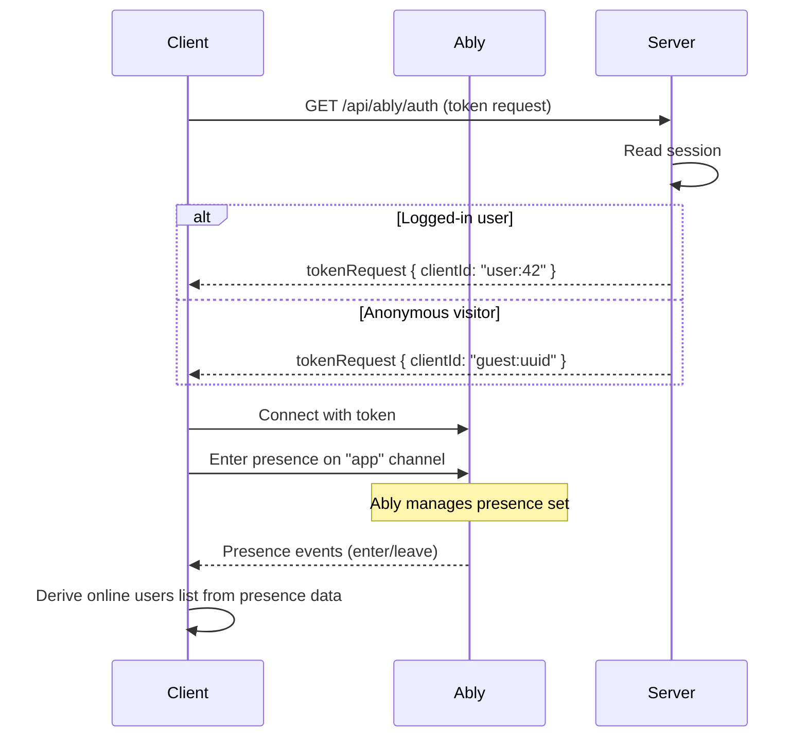

# Presence

Tracks who's online in real time using Ably's presence channels. Logged-in users are identified by user ID, anonymous visitors by a generated guest ID.

## How It Works

Every visitor connects to Ably via WebSocket and enters the `app` presence channel. Ably tracks who's connected — no polling, no server-side state. When a user connects or disconnects, Ably sends presence events (`enter`/`leave`) to all subscribers.

## Key Files

| File                                  | Purpose                                            |
| ------------------------------------- | -------------------------------------------------- |
| `src/lib/ably-provider.tsx`           | AblyProvider + AppPresence (enters "app" channel)  |
| `src/lib/ably-context.ts`             | `useAblyAvailable()` hook for SSR guards           |
| `src/lib/ably.server.ts`              | Ably REST singleton for server-side publishing     |
| `server/routes/api/ably/auth.get.ts`  | Token auth endpoint                                |
| `src/lib/presence/use-online.ts`      | `useOnlineUsers()` hook (reads Ably presence data) |
| `src/lib/presence/index.ts`           | Barrel export                                      |
| `src/components/online-indicator.tsx` | UI dropdown showing who's online                   |

## Design Decisions

- **Ably presence, not in-memory Maps** — presence state lives in Ably's infrastructure. Survives server restarts, works across multiple instances.
- **No polling** — WebSocket-based. Users appear/disappear instantly via presence events.
- **Token auth** — the server issues short-lived tokens via `createTokenRequest`. No API key exposed to the browser. Anonymous users get a generated `guest:{uuid}` client ID.
- **Client-side only** — presence data is not available during SSR. The online indicator fades in after hydration. The `useAblyAvailable()` guard prevents Ably hooks from running on the server.
- **`lastSeenAt` still tracked** — a slim server function updates `users.last_seen_at` in the DB for historical purposes (not used for online status).
