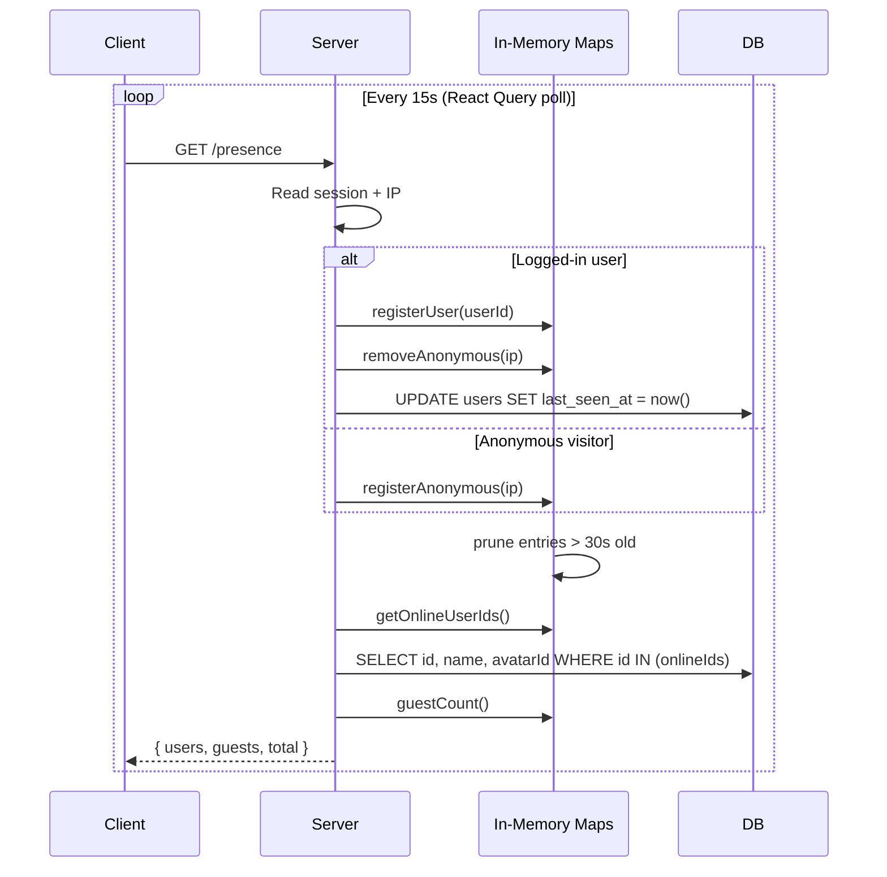

# Presence

Tracks who's online in real time using in-memory state on the server. Logged-in users are keyed by user ID, anonymous visitors by IP address.

## How It Works

Each client polls the server every 15 seconds via React Query's `refetchInterval`. Every poll doubles as a heartbeat — it registers the caller's presence, then returns the current online list. No separate heartbeat endpoint is needed.

Entries older than 30 seconds (2× the poll interval) are pruned on every read/write, giving one missed poll of grace before a user drops off.

## Key Files

| File                                  | Purpose                             |
| ------------------------------------- | ----------------------------------- |
| `src/lib/presence/state.ts`           | In-memory Maps + prune logic        |
| `src/lib/presence/fns.ts`             | Server function (heartbeat + query) |
| `src/lib/presence/index.ts`           | Facade with `queryOptions`          |
| `src/components/online-indicator.tsx` | UI dropdown showing who's online    |

## Design Decisions

- **In-memory, not DB/Redis** — ephemeral by design. State is lost on server restart and rebuilds within 15s as clients poll back in. Only works with a single server instance.
- **Poll = heartbeat** — combining the two into one request means the SSR call in the root loader includes the current visitor on first paint.
- **30s threshold** — 2× the 15s poll interval. One missed poll is tolerated; two consecutive misses marks the user as offline.
- **IP-based anonymous tracking** — users behind the same NAT/VPN count as one guest. The `"unknown"` fallback collapses all headerless requests into a single visitor.
- **React Query handles tab visibility** — polling pauses when the tab is hidden (`refetchIntervalInBackground` defaults to `false`) and refetches on focus restore, so backgrounded tabs don't generate traffic or keep users artificially "online".
