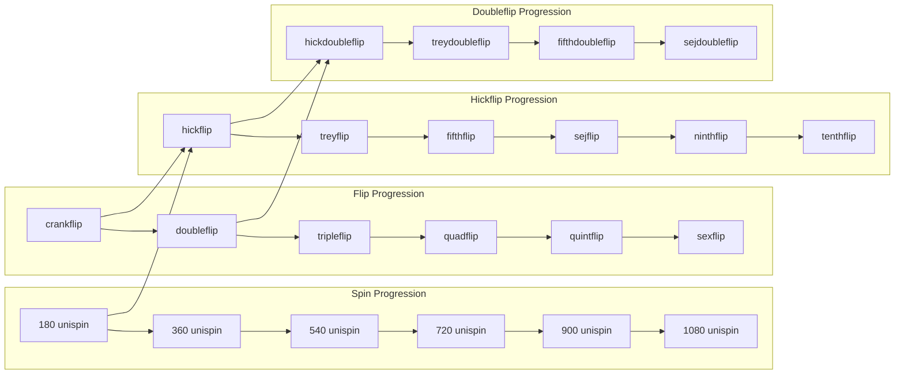
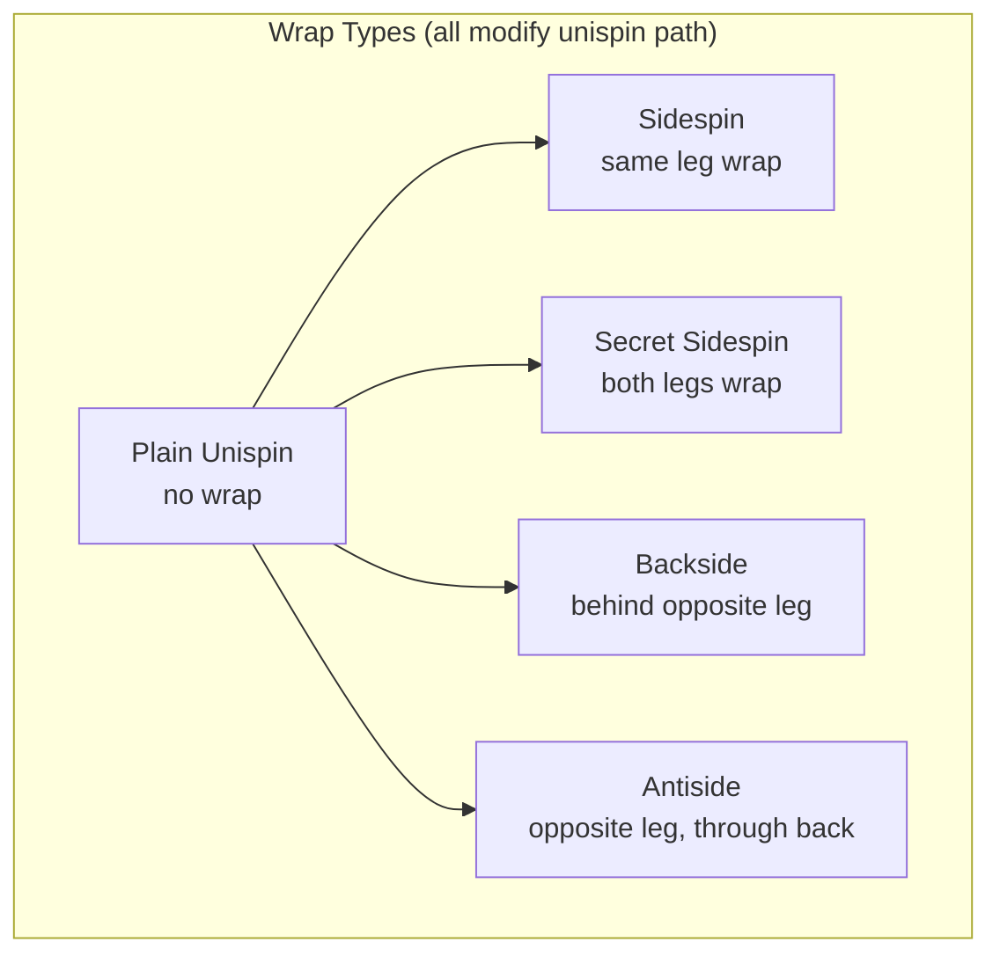

```mermaid
flowchart TD
    subgraph BASE["BASE COMPONENTS"]
        UNISPIN["Unispin<br/>180/360/540/720/900/1080/1260"]
        CRANKFLIP["Crankflip<br/>1-6 rotations forward"]
        BACKFLIP["Backflip<br/>1-6 rotations backward"]
        OVERFLIP["Overflip<br/>no footer, over the top"]
        UNDERFLIP["Underflip<br/>no footer, under"]
        BODYVARIAL["Body Varial<br/>180/360 body rotation"]
        WHIP["Whip<br/>frame rotation"]
    end

    subgraph WRAPS["WRAP MODIFIERS (modify unispin)"]
        SIDESPIN["Sidespin<br/>wrapped around same leg"]
        SECRETSIDE["Secret Sidespin<br/>wrapped around both legs"]
        BACKSIDE["Backside<br/>threaded behind opposite leg"]
        ANTISIDE["Antiside<br/>opposite leg, up through back"]
    end

    subgraph SPIN_FLIP["UNISPIN + FLIP COMBOS"]
        HICKFLIP["Hickflips<br/>hick/trey/fifth/sej/ninth/tenth"]
        HICKDOUBLE["Hickdoubleflips<br/>hick/trey/fifth/sej"]
        HICKTRIPLE["Hicktripleflips<br/>hick/trey/fifth/sej"]
        HICKQUAD["Hickquadflips<br/>hick/trey/fifth/sej"]
        HICKQUINT["Hickquintflips<br/>hick/trey"]
    end

    subgraph SPIN_BACK["UNISPIN + BACKFLIP COMBOS"]
        HICKBACK["Hickbackflips<br/>hick/trey/fifth/sej/ninth/tenth"]
    end

    subgraph WRAP_FLIP["WRAP + FLIP COMBOS"]
        SIDEFLIP["Sideflips<br/>hick/trey/fifth/sej/ninth/tenth"]
        SECRETFLIP["Secret Sideflips<br/>trey/fifth/sej + 1-3 flips"]
        BACKSIDEFLIP["Backsideflips<br/>hick/trey/fifth/sej + 1-3 flips"]
        ANTISIDEFLIP["Antisideflips<br/>hick/fifth + 1-2 flips"]
    end

    subgraph OVER_UNDER["OVERFLIP/UNDERFLIP COMBOS"]
        UNISPIN_OVER["Unispin Overflips<br/>hick 1-3, trey 1-2, fifth"]
        UNISPIN_UNDER["Unispin Underflips<br/>hick 1-2, trey 1-2, fifth"]
        STUTTER["Stutterflips<br/>flip then overflip"]
        FLIP_OVER["Flip to Overflip<br/>hickflip then overflip"]
        FLIP_UNDER["Flip to Underflip<br/>hickflip then underflip"]
        OVER_HICK["Overflip to Hickflip<br/>overflip then hickflip"]
        BACK_OVER["Backflip to Overflip"]
    end

    subgraph KICK["KICKFLIP COMBOS"]
        KICKFLIP["Kickflips<br/>hick/trey/fifth/sej"]
        SIDEKICK["Sidekickflips<br/>hick/trey/fifth/sej"]
    end

    subgraph BODY["BODY VARIAL COMBOS"]
        BODY_FLIP["Body Varial Flips<br/>180/360 + flip/doubleflip"]
        BODY_BACK["Body Varial Backflips<br/>180/360 + back/doubleback"]
        BODY_UNDER["Body Varial Flip-Underflip<br/>180/360"]
    end

    %% Base relationships
    UNISPIN --> SIDESPIN
    UNISPIN --> SECRETSIDE
    UNISPIN --> BACKSIDE
    UNISPIN --> ANTISIDE

    %% Spin + Flip combinations
    UNISPIN --> HICKFLIP
    CRANKFLIP --> HICKFLIP
    HICKFLIP --> HICKDOUBLE
    HICKDOUBLE --> HICKTRIPLE
    HICKTRIPLE --> HICKQUAD
    HICKQUAD --> HICKQUINT

    %% Spin + Backflip
    UNISPIN --> HICKBACK
    BACKFLIP --> HICKBACK

    %% Wrap + Flip combinations
    SIDESPIN --> SIDEFLIP
    CRANKFLIP --> SIDEFLIP
    SECRETSIDE --> SECRETFLIP
    CRANKFLIP --> SECRETFLIP
    BACKSIDE --> BACKSIDEFLIP
    CRANKFLIP --> BACKSIDEFLIP
    ANTISIDE --> ANTISIDEFLIP
    CRANKFLIP --> ANTISIDEFLIP

    %% Overflip/Underflip combinations
    UNISPIN --> UNISPIN_OVER
    OVERFLIP --> UNISPIN_OVER
    UNISPIN --> UNISPIN_UNDER
    UNDERFLIP --> UNISPIN_UNDER
    CRANKFLIP --> STUTTER
    OVERFLIP --> STUTTER
    HICKFLIP --> FLIP_OVER
    OVERFLIP --> FLIP_OVER
    HICKFLIP --> FLIP_UNDER
    UNDERFLIP --> FLIP_UNDER
    OVERFLIP --> OVER_HICK
    HICKFLIP --> OVER_HICK
    BACKFLIP --> BACK_OVER
    OVERFLIP --> BACK_OVER

    %% Kickflip combinations
    UNISPIN --> KICKFLIP
    SIDESPIN --> SIDEKICK

    %% Body varial combinations
    BODYVARIAL --> BODY_FLIP
    CRANKFLIP --> BODY_FLIP
    BODYVARIAL --> BODY_BACK
    BACKFLIP --> BODY_BACK
    BODYVARIAL --> BODY_UNDER
    CRANKFLIP --> BODY_UNDER
    UNDERFLIP --> BODY_UNDER
```

## Progression Chains (Prerequisites)

```mermaid
flowchart LR
    subgraph SPIN_PROG["Spin Progression"]
        U180["180 unispin"] --> U360["360 unispin"] --> U540["540 unispin"] --> U720["720 unispin"] --> U900["900 unispin"] --> U1080["1080 unispin"]
    end

    subgraph FLIP_PROG["Flip Progression"]
        F1["crankflip"] --> F2["doubleflip"] --> F3["tripleflip"] --> F4["quadflip"] --> F5["quintflip"] --> F6["sexflip"]
    end

    subgraph HICK_PROG["Hickflip Progression"]
        HF["hickflip"] --> TF["treyflip"] --> FF["fifthflip"] --> SF["sejflip"] --> NF["ninthflip"] --> TEN["tenthflip"]
    end

    subgraph DOUBLE_PROG["Doubleflip Progression"]
        HD["hickdoubleflip"] --> TD["treydoubleflip"] --> FD["fifthdoubleflip"] --> SD["sejdoubleflip"]
    end

    U180 --> HF
    F1 --> HF
    HF --> HD
    F2 --> HD
```

## Spin Naming Convention

```mermaid
flowchart LR
    D180["180deg = hick"] --> D360["360deg = trey"] --> D540["540deg = fifth"] --> D720["720deg = sej"] --> D900["900deg = ninth"] --> D1080["1080deg = tenth"]
```

## Modifier Relationships

```mermaid
flowchart TD
    subgraph WRAP_TYPES["Wrap Types (all modify unispin path)"]
        direction LR
        PLAIN["Plain Unispin<br/>no wrap"]
        SIDE["Sidespin<br/>same leg wrap"]
        SECRET["Secret Sidespin<br/>both legs wrap"]
        BACK["Backside<br/>behind opposite leg"]
        ANTI["Antiside<br/>opposite leg, through back"]
    end

    PLAIN --> SIDE
    PLAIN --> SECRET
    PLAIN --> BACK
    PLAIN --> ANTI
```
