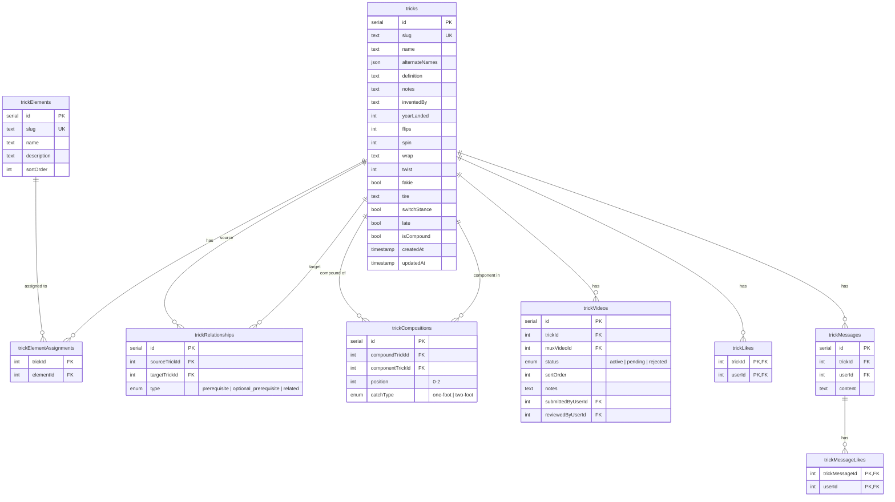
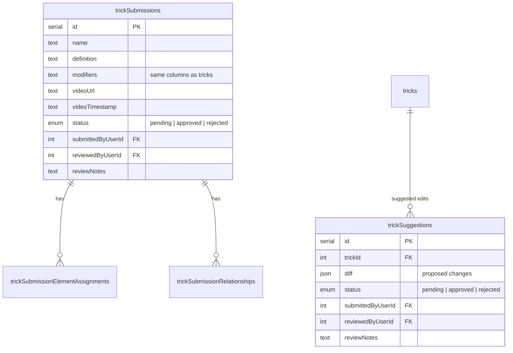
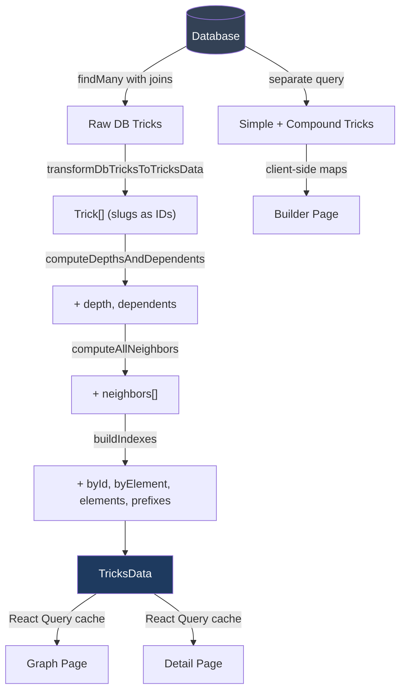
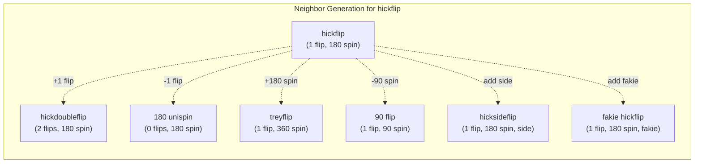
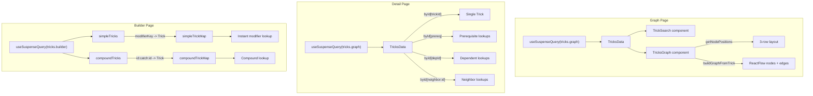

# Tricks Architecture

## Overview

The tricks system is a unicycling trick encyclopedia with three main interfaces:

1. **Builder** (`/tricks`) - A modifier panel where users dial in flip count, spin degrees, wrap type, etc. to look up or discover tricks by their mechanical properties
2. **Detail** (`/tricks/$trickId`) - A page showing a single trick's full info: videos, definition, prerequisites, dependents, nearby tricks
3. **Graph** (`/tricks/graph`) - An interactive ReactFlow visualization showing a center trick and its relationships (simpler tricks above, harder tricks below)

All three consume the same underlying data but through different lenses.

## Data Model



### Unique Constraint on Modifiers

The `tricks` table has a unique constraint on `(flips, spin, wrap, twist, fakie, tire, switchStance, late)` for non-compound tricks. This ensures no two simple tricks share the same modifier combination, which is what makes the builder's instant lookup work.

### Modifier Columns

Each simple trick is fully described by 8 modifier dimensions:

| Column         | Type | Values                                     |
| -------------- | ---- | ------------------------------------------ |
| `flips`        | int  | 0, 1, 2, 3... (crank rotations)            |
| `spin`         | int  | 0, 90, 180, 270, 360... (unispin degrees)  |
| `wrap`         | text | none, side, secretside, backside, antiside |
| `twist`        | int  | 0, 180, 360, 540 (body twist degrees)      |
| `fakie`        | bool | riding backwards                           |
| `tire`         | text | none, to tire, from tire, on tire          |
| `switchStance` | bool | opposite foot forward                      |
| `late`         | bool | delayed rotation                           |

### Relationships (Directed Graph)

`trickRelationships` stores three kinds of edges:

- **`prerequisite`** - "you should learn X before Y" (one per trick)
- **`optional_prerequisite`** - secondary skill that helps (one per trick)
- **`related`** - manually curated links (admin-tagged, multiple allowed)

These form a DAG used for learning path depth and the "unlocks" section on detail pages.

### Compositions (Compound Tricks)

Compound tricks are built from 2-3 simple tricks joined by catch types:

```
hickflip  --[two-foot]-->  crankflip  =  "hickflip to crankflip"
```

The `trickCompositions` table stores which component tricks make up a compound, their order (`position`), and how they're joined (`catchType`).

## Submission System



- **Submissions** - Users propose entirely new tricks (pending admin review)
- **Suggestions** - Users propose edits to existing tricks (stored as a diff)

Both follow the same review workflow: pending -> approved/rejected.

## Server Functions (`src/lib/tricks/fns.ts`)

| Function                         | Purpose                                                              | Used By                              |
| -------------------------------- | -------------------------------------------------------------------- | ------------------------------------ |
| `getAllTricksForGraphServerFn`   | Loads ALL tricks + relations, runs `transformDbTricksToTricksData()` | Graph, Detail pages                  |
| `getAllTricksForBuilderServerFn` | Loads simple + compound tricks with modifiers                        | Builder page                         |
| `getTrickServerFn`               | Single trick by slug with full relations                             | (available but pages use graph data) |
| `getTrickByIdServerFn`           | Single trick by ID with videos                                       | Admin edit                           |
| `searchTricksServerFn`           | ILIKE search, minimal fields                                         | Relationship selectors in forms      |
| `listTricksServerFn`             | Paginated list with filters                                          | Trick list views                     |

### The Graph Endpoint

`getAllTricksForGraphServerFn` is the workhorse. It:

1. Loads every trick from the DB with videos, elements, relationships, and compositions
2. Calls `transformDbTricksToTricksData()` which transforms DB rows into `Trick[]`
3. Runs `buildTricksData()` which computes **depth**, **dependents**, **neighbors**, and **indexes**
4. Returns the full `TricksData` structure to the client

This runs server-side (TanStack Start `createServerFn`) but recomputes everything on every request (cached by React Query on the client).

## Computed Data Pipeline



### What's Computed vs. Stored

| Data                                     | Stored in DB?      | Computed Where?                       | Notes                               |
| ---------------------------------------- | ------------------ | ------------------------------------- | ----------------------------------- |
| Trick properties (name, modifiers, etc.) | Yes                | -                                     | Core data                           |
| Relationships (prerequisite, related)    | Yes                | -                                     | `trickRelationships` table          |
| Compositions                             | Yes                | -                                     | `trickCompositions` table           |
| Videos                                   | Yes                | -                                     | `trickVideos` table                 |
| Element assignments                      | Yes                | -                                     | `trickElementAssignments` table     |
| **`depth`**                              | **No**             | Server (`computeDepthsAndDependents`) | BFS from prerequisite roots         |
| **`dependents`**                         | **No** (queryable) | Server (`computeDepthsAndDependents`) | Reverse of prerequisite edges       |
| **`neighbors`**                          | **No**             | Server (`computeAllNeighbors`)        | Algorithmic: one modifier step away |
| **`byId` / `byElement` indexes**         | No                 | Server (`buildIndexes`)               | In-memory lookup maps               |
| **Sort order within elements**           | No                 | Server (`compareTrickNames`)          | Parsed from trick names             |
| **Graph layout positions**               | No                 | Client (`getNodePositions`)           | Pure UI concern                     |
| **Builder lookup maps**                  | No                 | Client (route component)              | `modifierKey -> Trick` maps         |

## Computation Details

### `depth` - Prerequisite Chain Distance

BFS traversal starting from tricks with no prerequisite (roots get depth 0). Each step down the prerequisite chain increments depth by 1.

```
depth 0: crankflip (no prerequisite)
depth 1: hickflip (prerequisite: crankflip)
depth 2: treyflip (prerequisite: hickflip)
```

Used for sorting tricks within element groups (simpler tricks first).

### `dependents` - Reverse Prerequisites

For each trick with a prerequisite, the prerequisite's `dependents` array gets the dependent's ID pushed. This is the inverse of the relationship already stored in `trickRelationships` -- it's just not queried that way currently.

Used for the "unlocks" section on detail pages and "after" nodes in the graph.

### `neighbors` - Modifier-Adjacent Tricks

The most complex computation. For each simple trick, finds all other tricks that differ by exactly **one modifier step**:



For compound tricks, neighbors include:

- Each component trick (direction: "removes")
- Sibling compounds sharing a component (direction: "adds")
- Compounds where exactly one component is swapped for its one-step neighbor

**Algorithm:**

1. Build `Map<modifierKey, Trick>` for O(1) simple trick lookup
2. Build `Map<componentId, Trick[]>` for compound lookup
3. For each trick, generate all possible one-step modifier keys
4. Look up each key in the map to find real neighbors
5. Determine edge labels (`describeModifierDiff`) and direction (`modifierDirection`)

### Sort Key Parsing

Trick names are parsed into sortable components to handle progression naming:

```
"hickdoubleflip" -> { leadingNumber: 0, baseWords: "hickflip", progressionRank: 5 (double), suffix: "" }
"360 unispin"    -> { leadingNumber: 360, baseWords: "unispin", progressionRank: 3 (default), suffix: "" }
```

Sort order: base words -> leading number -> progression rank -> suffix.

## Graph Layout (`tricks-graph.tsx`)

The graph uses a manual 3-row layout (not force-directed):

```
        ┌──────────┐  ┌──────────┐  ┌──────────┐
        │  before   │  │  before   │  │  before   │    y = -VERTICAL_GAP
        │  (blue)   │  │  (blue)   │  │  (blue)   │
        └─────┬─────┘  └─────┬─────┘  └─────┬─────┘
              │              │              │
              └──────────────┼──────────────┘
                             │
                      ┌──────┴──────┐
                      │   CENTER    │                  y = 0
                      │  (primary)  │
                      └──────┬──────┘
                             │
              ┌──────────────┼──────────────┐
              │              │              │
        ┌─────┴─────┐  ┌────┴──────┐  ┌────┴──────┐
        │   after    │  │   after   │  │   after   │   y = +VERTICAL_GAP
        │  (green)   │  │  (green)  │  │  (green)  │
        └────────────┘  └───────────┘  └───────────┘
```

**Before row** (simpler tricks, blue edges):

1. Spin progression at -90 and -180 degrees (same modifiers except less spin)
2. Curated prerequisites
3. Computed neighbors with direction "removes"

**After row** (harder tricks, green edges):

1. Spin progression at +90 and +180 degrees
2. Curated dependents (up to 6)
3. Computed neighbors with direction "adds"

Max 5 nodes per row. Constants: `NODE_WIDTH=190`, `NODE_HEIGHT=90`, `HORIZONTAL_GAP=80`, `VERTICAL_GAP=150`.

## Client-Side Data Flow



## Opportunities: Frontend Computations to Move to DB

### 1. `depth` -> Column on `tricks` Table

**Current:** BFS traversal recomputed on every graph data request (server-side in `computeDepthsAndDependents`).

**Proposed:** Add an integer `depth` column to the `tricks` table. Recompute on trick create/update/delete via the mutation handlers in `fns.ts`. Only tricks in the affected prerequisite chain need updating.

**Why:** Depth is stable -- it only changes when prerequisite relationships change. Currently it's recomputed across ALL tricks on every request. A stored column eliminates that traversal entirely and can be used in ORDER BY clauses in SQL.

**Complexity:** Low. The recompute can be a simple SQL CTE or run the existing BFS logic in the mutation handler.

### 2. `dependents` -> Query Incoming Relationships

**Current:** Computed by iterating all tricks and building reverse-prerequisite lists in `computeDepthsAndDependents`. The data already exists in `trickRelationships` (just queried from the other direction).

**Proposed:** Query incoming prerequisite relationships directly instead of computing them. The `getTrickServerFn` already does this (`incomingRelationships`), but the graph endpoint doesn't use it. For the graph endpoint, either:

- Add `incomingRelationships` to the graph query and use them directly
- Or use a SQL subquery to get dependent IDs per trick

**Why:** This is already stored data being recomputed needlessly. The DB already knows which tricks depend on which.

**Complexity:** Very low. Just a query change.

### 3. `neighbors` -> `trickNeighbors` Junction Table

**Current:** Algorithmic computation in `computeAllNeighbors` runs on every graph data request. Generates neighbor keys, looks up modifier-adjacent tricks, finds compound relationships.

**Proposed:** Materialize neighbors into a `trickNeighbors` junction table:

```sql
CREATE TABLE trick_neighbors (
  trick_id INTEGER REFERENCES tricks(id) ON DELETE CASCADE,
  neighbor_id INTEGER REFERENCES tricks(id) ON DELETE CASCADE,
  label TEXT NOT NULL,       -- "more flips", "add side", "compound", etc.
  direction TEXT NOT NULL,   -- "adds" or "removes"
  PRIMARY KEY (trick_id, neighbor_id)
);
```

Rebuild affected rows whenever a trick is created, updated, or deleted.

**Why:** This is the most expensive computation. The neighbor algorithm is O(n) over all tricks for each trick, making it O(n^2) overall. It's deterministic and only changes when tricks change. Materializing it turns every graph request from O(n^2) compute into a simple join.

**Complexity:** Medium. Requires:

- New table + migration
- Rebuild logic in create/update/delete mutation handlers
- A "rebuild all neighbors" admin function for initial population
- Careful handling of cascading updates (changing one trick's modifiers affects its neighbors' neighbor lists)

### 4. Sort Key -> Computed Column

**Current:** `getTrickSortKey()` parses trick names into `{ leadingNumber, baseWords, progressionRank, suffix }` every time sorting is needed.

**Proposed:** Store a `sortKey` text column (e.g., `"flip:0:3:"`) computed on create/update. Use it in ORDER BY.

**Why:** Eliminates repeated name parsing. Makes SQL-level sorting possible.

**Complexity:** Low. Compute once on save.

### Summary

| Computation  | Effort   | Impact                          | Recommendation                                   |
| ------------ | -------- | ------------------------------- | ------------------------------------------------ |
| `dependents` | Very low | Eliminates redundant iteration  | Do first -- just change the query                |
| `depth`      | Low      | Eliminates BFS on every request | Do second -- add column + recompute in mutations |
| Sort key     | Low      | Enables SQL-level sorting       | Nice to have                                     |
| `neighbors`  | Medium   | Eliminates O(n^2) computation   | Most impactful but needs careful migration       |

## File Reference

| File                                                | Purpose                                                   |
| --------------------------------------------------- | --------------------------------------------------------- |
| `src/db/schema.ts`                                  | Database table definitions (Drizzle ORM)                  |
| `src/lib/tricks/fns.ts`                             | Server functions (CRUD + bulk queries)                    |
| `src/lib/tricks/schemas.ts`                         | Zod validation schemas                                    |
| `src/lib/tricks/types.ts`                           | TypeScript types (`Trick`, `TricksData`, etc.)            |
| `src/lib/tricks/compute.ts`                         | Computation pipeline (depth, neighbors, indexes, sorting) |
| `src/lib/tricks/index.ts`                           | Barrel export / facade object                             |
| `src/components/tricks/tricks-graph.tsx`            | ReactFlow graph with layout algorithm                     |
| `src/components/tricks/trick-node.tsx`              | Individual graph node component                           |
| `src/components/tricks/trick-detail.tsx`            | Trick detail modal (used in older flows)                  |
| `src/components/forms/trick.tsx`                    | Create/edit form                                          |
| `src/routes/tricks/index.tsx`                       | Builder page (modifier panel)                             |
| `src/routes/tricks/$trickId.tsx`                    | Detail page                                               |
| `src/routes/tricks/graph.tsx`                       | Graph explorer page                                       |
| `src/routes/_authed/admin/tricks/$trickId/edit.tsx` | Admin edit page                                           |
